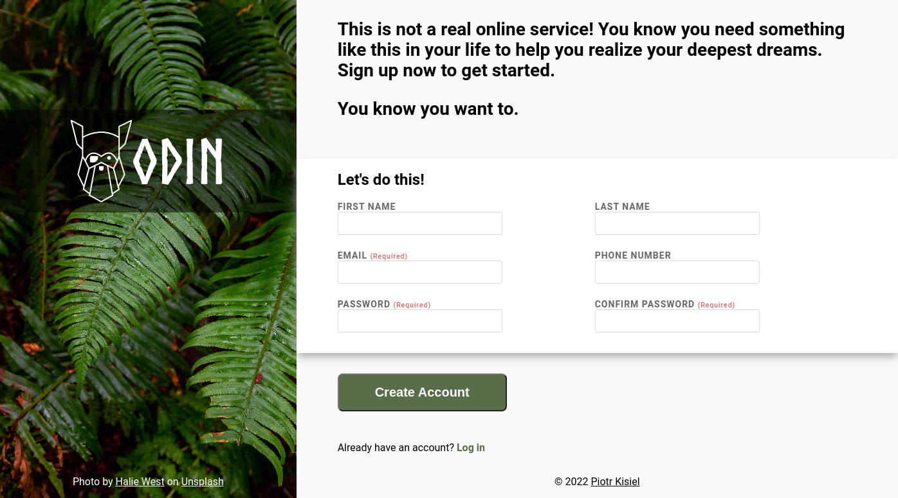

# Sign-up-form

This is a solution to the [sign-up-form project](https://www.theodinproject.com/lessons/node-path-intermediate-html-and-css-sign-up-form) from [The Odin Project](https://www.theodinproject.com).

# [Live view](https://pietyr.github.io/sign-up-form/)

## Table of contents

-   [Overview](#overview)
    -   [The challenge](#the-challenge)
        -   [Design](#design)
    -   [Screenshot](#screenshot)
        -   [Desktop view](#desktop-view)
-   [My process](#my-process)
    -   [Built with](#built-with)
    -   [What I learned](#what-i-learned)
-   [Author](#author)

## Overview

### The challenge

The challenge is to build a sign-up form for an imaginary service.

#### Design

### Screenshot

## My process

### Built with

-   Semantic HTML5 markup
-   CSS custom properties
-   Flexbox
-   Javascript

### What I learned

-   DOM manipulation
-   Styling form elements
-   Basic validation using HTML attributes and JavaScript

## Author

-   Piotr Kisiel
-   Github - [pietyr](https://github.com/pietyr)
